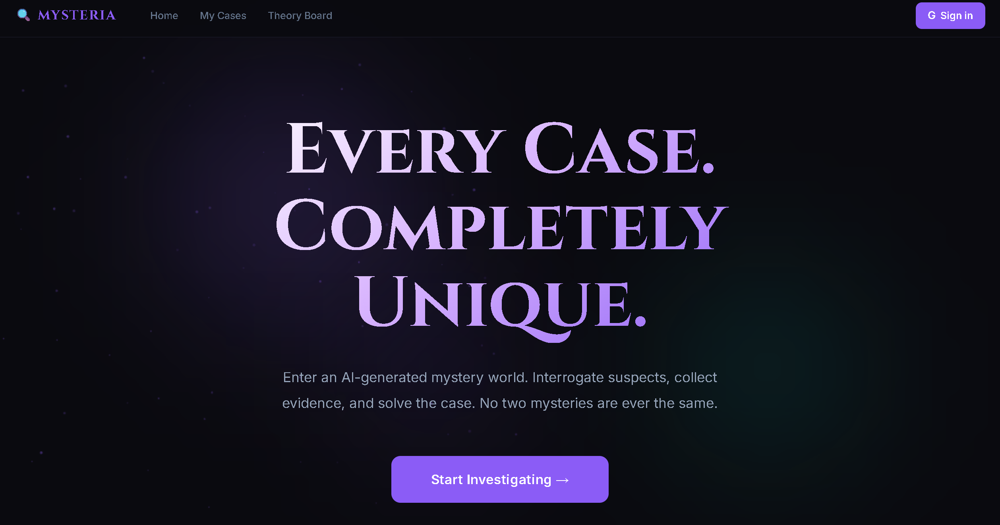
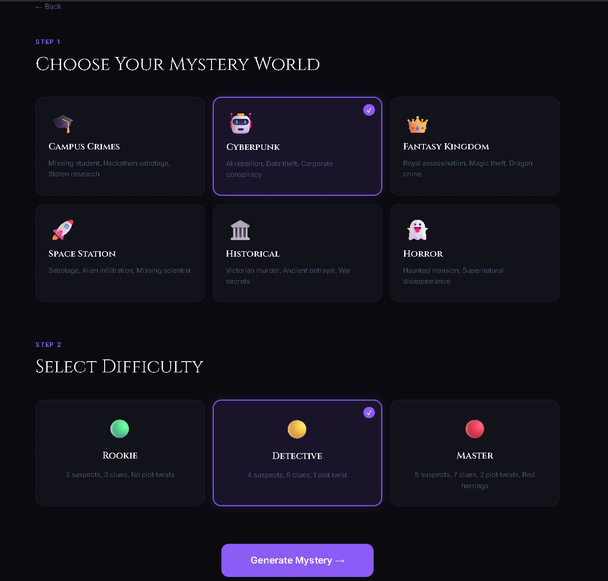
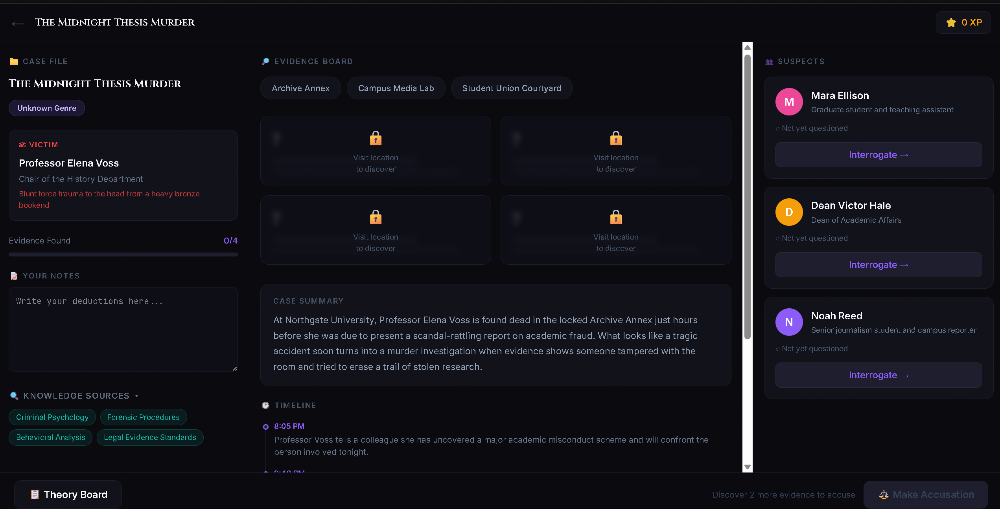
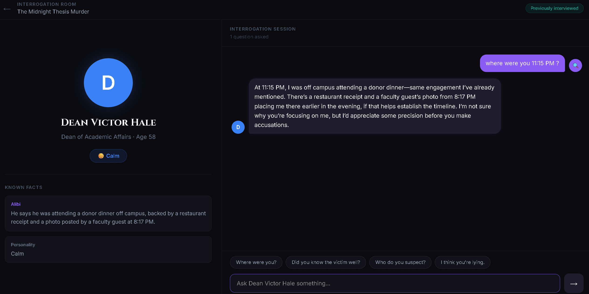
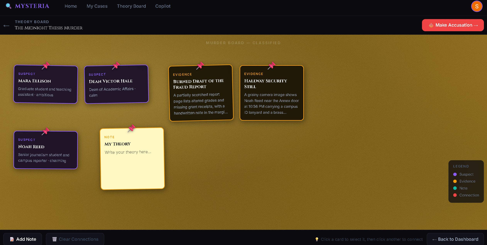
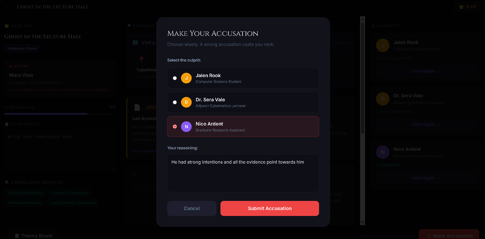
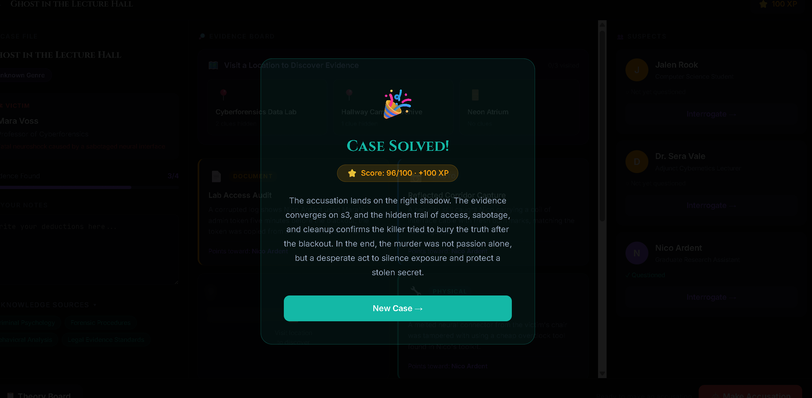
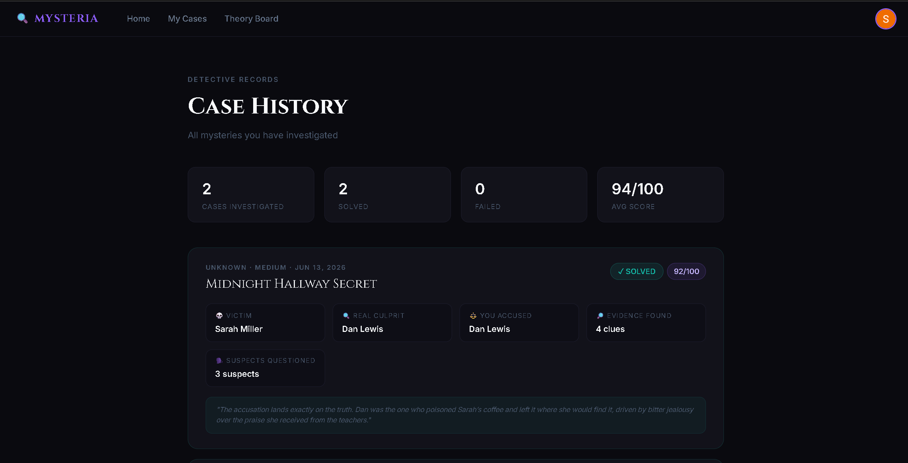

# 🔍 Mysteria AI — Infinite Mystery Worlds

> **AI creates the mystery. You solve the case.**

Mysteria AI is an **AI-powered detective game** where every player gets a completely unique mystery world. The AI generates an original case — victim, suspects, evidence, motives, and a hidden truth — every single time.

You don't replay the same story. You investigate a crime that has **never existed before**.

---

## Screenshots

### 🏠 Landing Page

*"Every Case. Completely Unique." — cinematic dark hero with particle background*

### 🔎 Case Generator

*Choose your mystery world and difficulty. Cyberpunk selected, Detective difficulty — AI builds the case.*

### 📋 Investigation Dashboard

*Three-panel layout: Case File + Evidence Board + Suspects. "The Midnight Thesis Murder" — Professor Elena Voss found dead in the Archive Annex.*

### 🎭 Interrogation Room

*Dean Victor Hale stays calm and consistent. Ask the wrong questions and he deflects. Corner him with evidence and watch his story crack.*

### 🧵 Theory Board

*Cork-board murder board. Drag suspect and evidence cards. Connect them with red string. Just like detective movies.*

### ⚖️ Make Your Accusation

*Choose the culprit, write your reasoning. A wrong accusation costs you rank.*

### 🎉 Case Solved

*Score: 96/100 · +100 XP. The AI reveals the full truth behind the case.*

### 📁 Case History

*Every past investigation stored. Real culprit vs. your accusation. Evidence found. Score.*

---

## How It Works

```
Choose Genre + Difficulty
        ↓
Azure AI Foundry generates complete mystery
(victim · suspects · evidence · hidden truth)
        ↓
Explore locations → discover evidence
        ↓
Interrogate AI suspects
(they remember · they lie · they crack)
        ↓
Connect clues on the Theory Board
        ↓
Make your accusation
        ↓
AI reveals the truth · awards score
```

---

## Features

| Feature | Description |
|---|---|
| 🌍 **6 Mystery Worlds** | Campus Crimes, Cyberpunk, Fantasy Kingdom, Space Station, Historical, Horror |
| 🧠 **AI Mystery Generation** | Azure GPT-4o builds a fully connected case from scratch every time |
| 🎭 **Interrogation System** | Suspects remember every question, lie when guilty, crack under pressure |
| 🧵 **Cork Board Theory Board** | Drag-and-drop murder board with red string connections between cards |
| ⚖️ **AI Case Evaluation** | Submit your accusation and reasoning — AI judges your logic and reveals the truth |
| 📚 **Foundry IQ Grounding** | Forensic procedures, criminal psychology, and world-specific facts ground every mystery |
| 🏅 **Detective Progression** | XP, scores, case history — track every investigation |
| ♾️ **Infinite Replayability** | No two mysteries are ever the same |

---

## Tech Stack

```
Frontend          React · Vite · Tailwind CSS · Framer Motion · Zustand
Backend           Node.js · Express
AI Engine         Azure AI Foundry · Azure OpenAI GPT-4o
Knowledge Layer   Microsoft Foundry IQ
Database          Firebase Firestore
Auth              Firebase Authentication (Google)
Built with        GitHub Copilot
Deployed on       Netlify (frontend) · Render (backend)
```

---

## Microsoft Technologies

### Azure AI Foundry (GPT-4o)
Powers three core systems:
- **Mystery Generation** — creates a fully connected case with consistent characters, evidence, and a hidden truth
- **Character AI** — suspects respond in-character, maintain conversation memory, and react to evidence
- **Case Evaluation** — judges the player's accusation and reasoning, reveals the true ending

### Foundry IQ
Before generating each mystery, the backend queries Foundry IQ for:
- Criminal psychology relevant to the genre
- Forensic investigation procedures  
- Historical or worldbuilding references

These facts are injected into the generation prompt. The Investigation Dashboard shows a **Knowledge Sources** panel listing every Foundry IQ source used in that case.

### GitHub Copilot
Every component in this project was scaffolded using GitHub Copilot — from the cork board Theory Board to the interrogation conversation engine. See the [Copilot Showcase page](https://mysteria-ai.netlify.app/copilot) for the exact prompts used.

---

## Local Setup

### Prerequisites
- Node.js 18+
- Azure OpenAI resource with GPT-4o deployed
- Firebase project with Firestore + Google Auth enabled

### Backend
```bash
cd backend
npm install
cp .env.example .env
# Fill in your Azure OpenAI and Firebase credentials
npm start
```

### Frontend
```bash
cd frontend
npm install
cp .env.example .env
# Fill in your Firebase config and backend URL
npm run dev
```

### Environment Variables

**backend/.env**
```
PORT=3001
AZURE_OPENAI_ENDPOINT=https://your-resource.openai.azure.com/
AZURE_OPENAI_KEY=your_key_here
AZURE_OPENAI_DEPLOYMENT=gpt-4o
FOUNDRY_IQ_ENDPOINT=your_endpoint
FOUNDRY_IQ_KEY=your_key
```

**frontend/.env**
```
VITE_FIREBASE_API_KEY=
VITE_FIREBASE_AUTH_DOMAIN=
VITE_FIREBASE_PROJECT_ID=
VITE_FIREBASE_STORAGE_BUCKET=
VITE_FIREBASE_MESSAGING_SENDER_ID=
VITE_FIREBASE_APP_ID=
VITE_API_BASE_URL=http://localhost:3001
```

---

## Project Structure

```
mysteria-ai/
├── frontend/
│   └── src/
│       ├── pages/
│       │   ├── Landing.jsx          # Hero + genre showcase
│       │   ├── Generator.jsx        # Genre + difficulty picker
│       │   ├── Dashboard.jsx        # Main investigation screen
│       │   ├── Interrogation.jsx    # AI character chat
│       │   ├── TheoryBoard.jsx      # Cork board murder board
│       │   ├── CaseHistory.jsx      # Past investigations
│       │   └── CopilotShowcase.jsx  # GitHub Copilot page
│       ├── store/
│       │   └── mysteryStore.js      # Zustand global state
│       └── lib/
│           ├── firebase.js          # Firebase init
│           └── api.js               # Backend API calls
└── backend/
    └── src/
        ├── services/
        │   ├── azureOpenAI.service.js   # GPT-4o integration
        │   └── foundryIQ.service.js     # Knowledge grounding
        └── routes/
            ├── mystery.routes.js        # Case generation
            ├── interrogation.routes.js  # Character AI
            └── accusation.routes.js     # Case evaluation
```

---

## Built for Microsoft Agents League

**Track:** Creative Apps  
**Special Award Target:** Best Use of IQ Tools

Mysteria AI demonstrates that generative AI can power **interactive experiences** — not just conversations. Players don't chat with AI. They investigate, deduce, and solve mysteries that were built uniquely for them.
